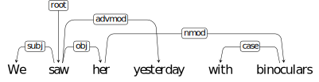
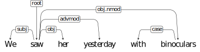

# Assignment 12: Exercises with dependency treebanks

This is a *graded* assignment.
Follow the link at the 
[private course page](https://github.com/dsacl3-2018/dsacl3) to
work on your own repository.
The deadline for this assignment is **Friday, Feb 22 2019, 12:00 CET**.

You are strongly recommended to use git
properly/productively: commit every 'unit' of work
(e.g., individual exercises) and bug fixes separately.
You do not need to worry about the mistakes in the earlier commits.
Your assignment will be evaluated based only on
the final commit before the deadline.

In this set of exercises you will work with dependency trees and
dependency treebanks. We will not do a full dependency parsing
exercise, but work on three relevant smaller exercises. 
Your knowledge from graph theory and graph algorithms will also be
handy for the solutions of these problems.

Although the programs you develop should be general,
and can be used with any dependency treebank,
in this assignment, we will use 
[Universal Dependencies](https://universaldependencies.org/)
treebanks, which are freely available from the link above.

Some utilities for handling (reading/writing)
[CoNLL-U files](https://universaldependencies.org/format.html)
is provided as [conllu.py](conllu.py). You are free to use it for the
following exercises. You can also extend it if you find it
necessary, or just write your own routines to handle CoNLL-U files
from scratch.
Do not use other CoNLL-U/UD libraries
or code from them for the exercises below.

For all of the exercises, we are interested in _primary
dependencies_ (columns 7 and 8). You do not need to pay attention to
the extended dependencies (column 9).

## 1. Statistics on word order

- Write a Python program that reads a treebank in CoNLL-U format,
    and produces the following statistics only for sentences with
    a verbal main predicate (root should be VERB).

    - Number and percentage of all combinations of subject, object and verb 
        orders if both subject and object arguments are present.
        You should skip the cases if one or both of the arguments
        are not present in the sentence, but include clausal arguments.
    - Number and percentage of all verb-subject and verb-object orders,
        for all main verbal predicates.

    The template for this exercise is in file [stats.py](stats.py).

    Your program should take a single command-line argument,
    the name of the CoNLL-U file, and output the statistics you are
    gathered similar to the following:

```
SVO     10  5%
SOV     50  25%
...

```


- Using at least 5 treebanks 
    (preferably from typologically different languages
    with respect to word order),
    produce the above statistics on each language, writing the
    output to a text file `AAA.txt`, where `AAA` is the 
    [ISO 639-2 code](https://en.wikipedia.org/wiki/List_of_ISO_639-2_codes)
    for the language.  You can find typological differences, including
    the word order differences, between man languages of the world
    on [WALS](https://wals.info/).

Do not forget to check in your dat files (text files with statistics
with your choice of languages) as well as your code.

## 2. Finding and counting non-projective trees

Write another Python program that finds and counts the number of
non-projective trees in a treebank in CoNLL-U format. 
Your program should take a single command-line argument,
the name of the CoNLL-U file, and output the number and ratio
(percentage) of non-projective trees in the treebank.

Update the texts files you created in Exercise 1,
by adding a single line similar to the following example. 

```
NON-PROJ    20  0.5%
```

You are encouraged to also count the number of crossing dependencies,
but not required for this assignment. Detecting a single crossing
dependency is enough as counting a sentence as non-projective.

The template for this exercise is in file [non-proj.py](non-proj.py).

## 3. Pseudo projectivization

Given a non-projective parser, one way to deal with non-projectivity
is to "projectivize" the trees during training, and postprocess the
parser output to obtain non-projective trees. 

To create a projective tree from a non-projective one, crossing
dependencies are modified by moving the head of the dependency one
level up until the dependency is not non-projective. The
non-projectivity information is typically encoded in the dependency
labels. Given a non-projective edge, _(w1, l1, w2)_
where _w1_ is the head and _l1_ is the relation type, we replace
it with _(w0, l0.l1, w2)_ where _w0_ is the head of _w1_ and _l0_ is
the relation label between _w1_ and _w0_, that is, there is a
dependency  _(w0, l0, w1)_.

For example, given the following tree



we convert it to:



Make sure that your tree has a single root (there is only one token
with head 0), after the conversion.

The template for this exercise is in file [pseudo-proj.py](pseudo-proj.py).
A few toy non-projective trees are given in [non-proj.conllu](non-proj.conllu),
which you can use for testing your code.

## 4. (optional) post processing pseudo-projective trees

Write another Python script to convert a pseudo-projective tree as
described in Exercise 3 above back to its non-projective original.
For this exercise, you can assume that the combined relation labels
(like _obj.nmod_ above) are not ambiguous.

This exercise will not be part of your graded work, but recommended
to gain more insight into the problem.
